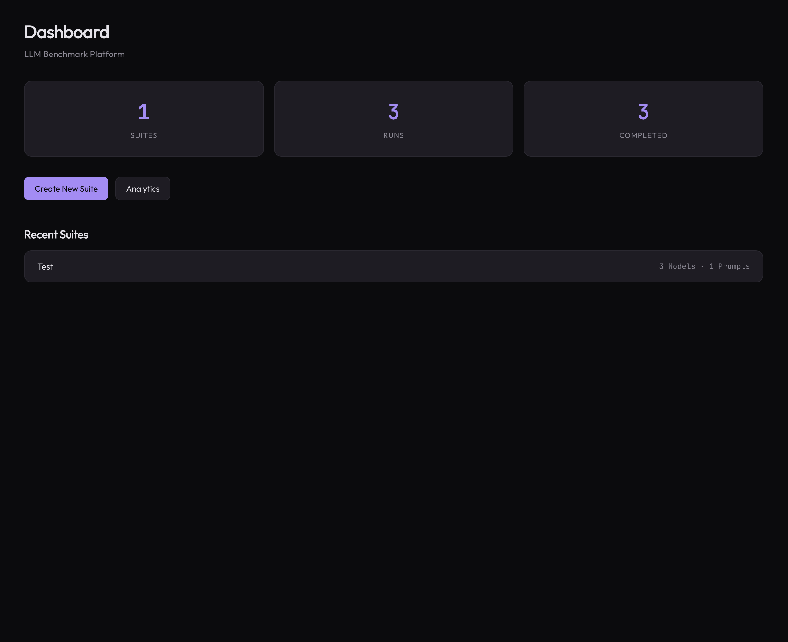
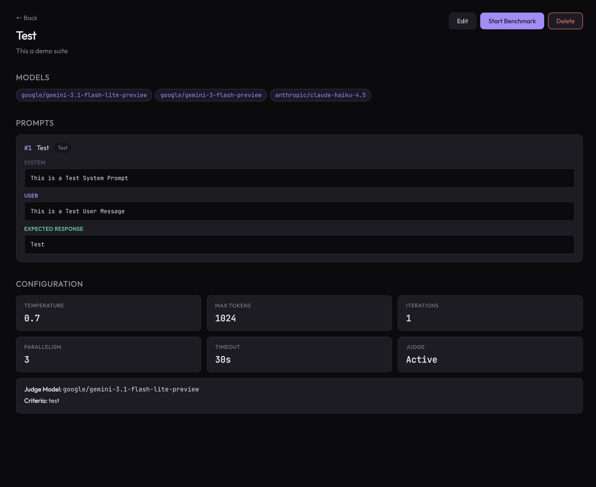
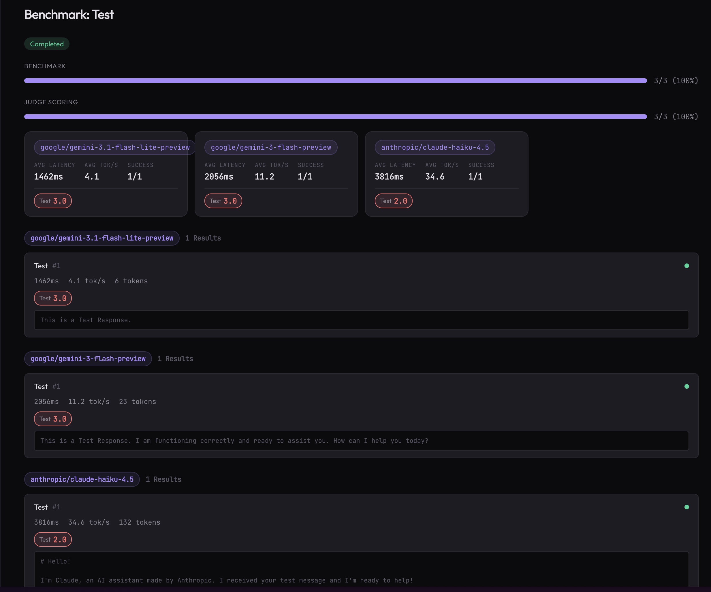
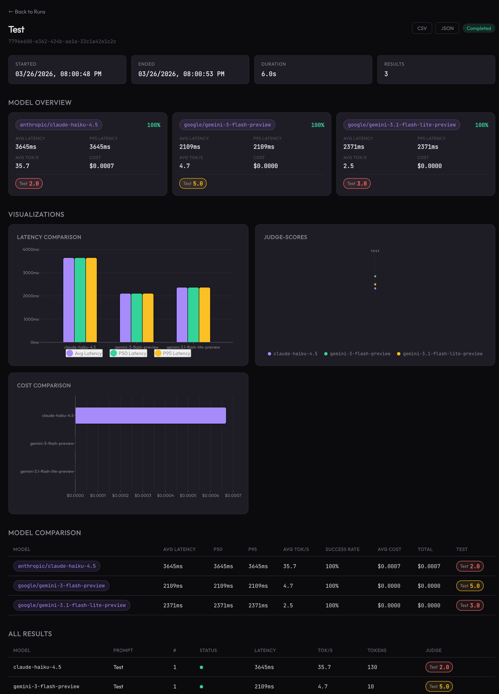
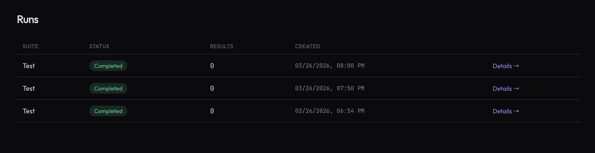
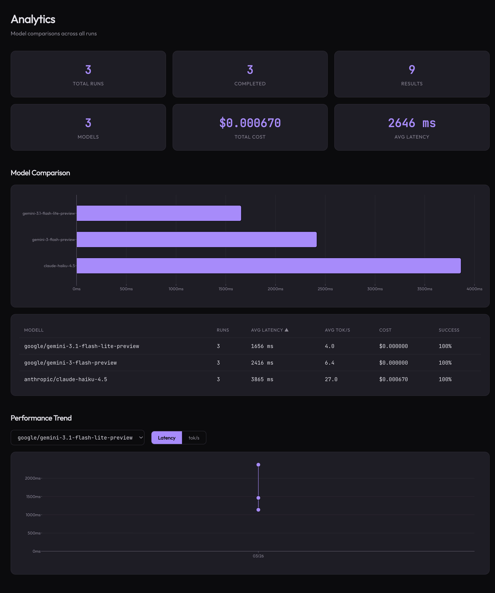

# Krites

[](https://go.dev)
[](LICENSE)

> **Krites** derives from Greek *κρίνω* (krinō, "to judge") — exactly what the platform does: judge models. The word *criterion* shares the same root.

An LLM benchmark platform — send identical prompts to multiple models, measure latency/throughput/cost/quality, and visually compare results. Built with Go + SvelteKit.

## Screenshots

| Dashboard | Suite Configuration |
|:-:|:-:|
|  |  |

| Live Benchmark Run | Run Detail with Charts |
|:-:|:-:|
|  |  |

| Run History | Analytics |
|:-:|:-:|
|  |  |

## Features

- **Side-by-Side Model Comparison** — Benchmark multiple LLMs with the same prompts
- **Real-Time Streaming** — Watch results arrive live via SSE as benchmarks run
- **Rich Metrics** — TTFB, total latency, tokens/sec, cost estimation per model
- **LLM-as-Judge** — Optional automated quality scoring on configurable criteria (1-10 scale)
- **Interactive Charts** — Latency bars, cost comparison, judge radar charts, iteration trends
- **Analytics Dashboard** — Cross-run model comparisons and performance trends
- **300+ Models** — Access via OpenRouter API (OpenAI, Anthropic, Google, Meta, etc.)
- **Model Browser** — Search, filter, and sort all available models by provider, context length, and price
- **Export** — Download results as CSV or JSON
- **Docker Ready** — Full-stack deployment with Docker Compose

## Quick Start

### Local Development

```bash
git clone https://github.com/hra42/krites.git
cd krites

# Start backend
export OPENROUTER_API_KEY="your-key-here"
go run main.go

# Start frontend (in another terminal)
cd frontend
npm install
npm run dev
```

Backend runs on `http://localhost:8080`, frontend on `http://localhost:5173`.

### Docker Compose

```bash
cp .env.example .env
# Edit .env and set your OPENROUTER_API_KEY
docker compose up -d
```

Frontend at `http://localhost:3000`, backend at `http://localhost:8080`.

## How It Works

1. **Create a Suite** — Define prompts, select models, configure parameters (temperature, tokens, iterations, parallelism)
2. **Run a Benchmark** — Each `(model × prompt × iteration)` tuple is executed as a parallel API call
3. **Watch Live Results** — Results stream in real-time, grouped by model with live aggregates
4. **Analyze** — Compare models via summary cards, charts, and detailed tables
5. **Judge (Optional)** — Enable LLM-as-Judge to score responses on criteria like accuracy, coherence, helpfulness

## Architecture

```
SvelteKit Frontend (Port 5173/3000)
       │ REST + SSE
Go Backend (Port 8080)
       │                    │
  OpenRouter API       DuckDB (persistence)
  (300+ models)
```

### Tech Stack

| Layer | Technology |
|-------|-----------|
| Backend | Go, Fiber, DuckDB |
| Frontend | SvelteKit, TypeScript, Chart.js |
| LLM Access | OpenRouter API |
| Streaming | Server-Sent Events (SSE) |
| Deployment | Docker Compose |

### API Endpoints

| Method | Path | Description |
|--------|------|-------------|
| `GET` | `/benchmarks/suites` | List all suites |
| `POST` | `/benchmarks/suites` | Create a new suite |
| `GET` | `/benchmarks/suites/:id` | Get suite details |
| `PUT` | `/benchmarks/suites/:id` | Update a suite |
| `DELETE` | `/benchmarks/suites/:id` | Delete a suite |
| `POST` | `/benchmarks/suites/:id/run` | Start a benchmark run (returns 202) |
| `GET` | `/benchmarks/runs` | List all runs |
| `GET` | `/benchmarks/runs/:id` | Get run with results + summary |
| `GET` | `/benchmarks/runs/:id/stream` | SSE stream for live updates |
| `GET` | `/benchmarks/runs/:id/export` | Export results (CSV/JSON) |
| `GET` | `/benchmarks/analytics/overview` | Platform statistics |
| `GET` | `/benchmarks/analytics/models` | Cross-run model comparison |
| `GET` | `/benchmarks/analytics/trends` | Model performance trends |
| `GET` | `/v1/models` | List available OpenRouter models |

## Configuration

Config loads from `config.yaml` with `${ENV_VAR}` expansion:

```yaml
server:
  port: 8080
  env: development

openrouter:
  api_key: "${OPENROUTER_API_KEY}"
  base_url: "https://openrouter.ai/api/v1"

database:
  services_dir: "./data/services"
```

**Required**: `OPENROUTER_API_KEY` environment variable.

## Build & Test

```bash
go build -o krites .         # Build backend
go test ./...                 # Run all tests
cd frontend && npm run build  # Build frontend
```

## License

This project is licensed under the [Unlicense](LICENSE).
